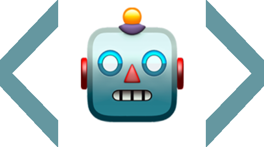

#  TrekBot
TrekBot is a tool to exercise the vintage computer game 'superstartrek'. It acts
as a player, and plays repeated games to exercise all corners of the game. 

TrekBot is part of the TrekBasic family of BASIC programming tools.
* [TrekBasic](https://github.com/cocode/TrekBASIC) - Python version
* [TrekBasicJ](https://github.com/cocode/TrekBasicJ) - Java Version
* [BasicRS](https://github.com/cocode/BasicRS) - Rust version
* [BasicTestSuite](https://github.com/cocode/BasicTestSuite) - A test suite of BASIC Programs
* [TrekBot](https://github.com/cocode/TrekBot) - A tool to exercise the superstartrek program

All versions are intended to by byte-by-byte compatible, but are not
there yet - but they are close. TrekBot and BasicTestSuite are part of
plan to ensure full compabtiblity. 

TrekBasic and TrekBasicJ are also compilers, and the compatibility
targets are the same for the compiled versions. A compiler for BasicRS is planned.

## Running TrekBot

### To run with coverage:

```
cargo run -- benchmark --program ../BasicRS/superstartrek.bas --games 5 --coverage-file coverage.json
```
### Full command with more options

```
cargo run -- benchmark --program superstartrek.bas --display --max-turns 1000 --strategy random --interpreter basic-rs --basicrs-path /Users/tomhill/RustroverProjects/BasicRS/target/debug/basic_rs  --coverage-file coverage.json
# Generate reports
```

# Code Coverage Report

These both generate a code coverage report. The code coverage report generator
is part of the various basic implementions. You'll need to run it from the BASIC interpreter
directory, and point to the coverage file generated by TrekBot.

In this case, BasicRS is next to TrekBot:


```
cd ../BasicRS
cargo run --bin basic_coverage -- ../TrekBot/coverage.json superstartrek.bas --verbose

cargo run --bin basic_coverage -- ../TrekBot/coverage.json superstartrek.bas --html coverage_report.html
```